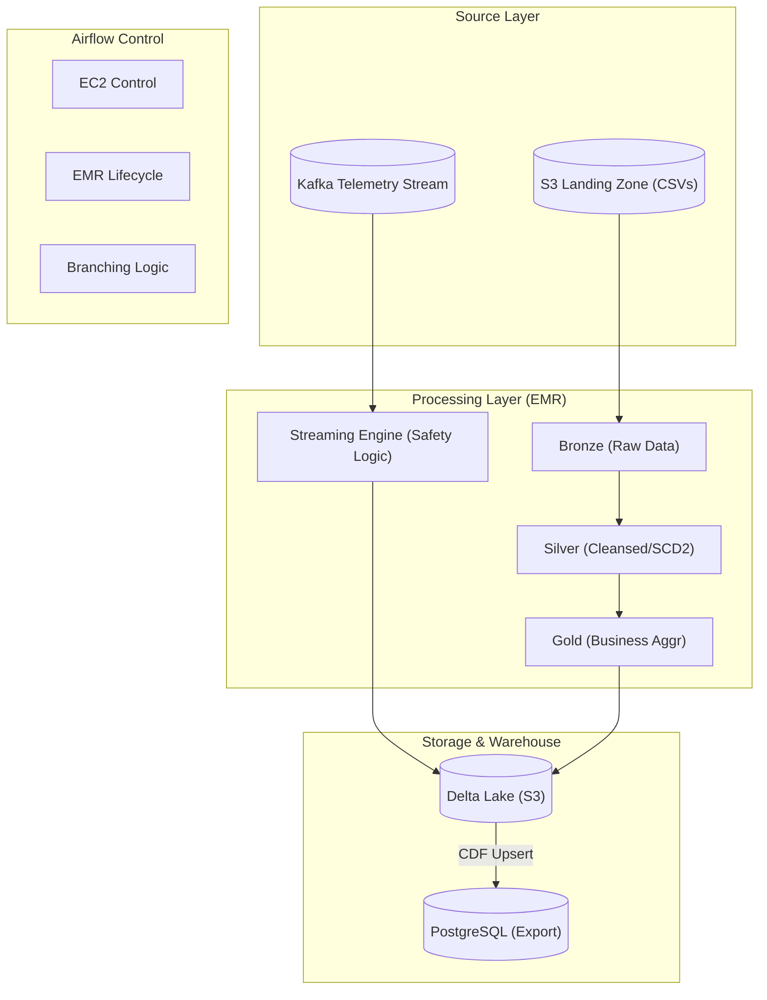

# OmniRoute Smart Logistics Engine

## Overview
This repository implements a **production-ready, idempotent data pipeline** for the OmniRoute Smart Logistics Engine. The pipeline processes both **Batch** and **Real-Time Streaming** data to manage fleet operations, ensure driver safety, and automate financial audits. It utilizes a Bronze → Silver → Gold (Delta Lake) architecture on AWS, orchestrated by Apache Airflow.

## Business Requirements Document (BRD) - Key Specifications
The "Enhancing Logistics Engine with New Features" document defines the following core logic:

### 1. Batch Processing Schedule
- **Daily @ 00:00 UTC**: Vehicle Registry & Assignment (Incremental Updates).
- **Daily @ 07:00 UTC**: Fuel Transactions (Efficiency Audit).
- **Monthly @ 1st of month**: Driver Standing Report & Salary Cooldown.
- **Yearly @ Jan 1st**: Maintenance Schedule ingestion.

### 2. Real-Time Streaming Logic (Kafka)
- **Violation Detection**: Flags vehicles exceeding **110 km/h** or entering coordinates defined in `restricted_zones.json`.
- **Penalty System**: A "Safety Strike" results in a **5% deduction** from the driver's `daily_rate`.
- **Suspension**: Drivers hitting **10 strikes** are moved to `SUSPENDED` status and blocked from the fleet.
- **Monthly Cooldown**: On the 1st of each month, strike counts reset to 0 and rates are restored (for non-suspended drivers).

## Architecture
The system is built on **AWS** and orchestrated by **Apache Airflow**:
- **Batch Layer**: Ephemeral EMR clusters running Spark jobs on S3 Delta Lake.
- **Streaming Layer**: Spark Streaming/Flink ingesting Kafka telemetry for real-time safety flagging.
- **Database**: PostgreSQL (EC2) with Change-Data-Feed (CDF) for efficient incremental exports.

## Data Model & Relationships

| Layer | Dataset | Description | Key Columns | Frequency |
| :--- | :--- | :--- | :--- | :--- |
| **Bronze** | `vehicle_registry` | Raw vehicle catalog snapshot | `vin`, `model`, `fuel_type` | Daily |
| | `vehicle_assignment` | Incremental driver-vehicle mapping | `vin`, `driver_id`, `daily_rate` | Daily |
| | `fuel_transactions` | Logs for efficiency calculations | `vin`, `fuel_liters`, `odometer` | Daily |
| | `telemetry_stream` | **Kafka JSON** real-time events | `vin`, `speed`, `lat`, `long` | Real-time |
| **Silver** | `asset_history` | **SCD Type 2** tracking of driver swaps | `vin`, `driver_id`, `effective_to` | Batch |
| | `clensed_telemetry`| Filtered safety violations | `vin`, `strike_type`, `ts` | Streaming |
| **Gold** | `vehicle_gold` | Asset History with salary adjustments | `vin`, `current_adjusted_rate` | Batch |
| | `fuel_audit` | Efficiency vs 12% Threshold | `vin`, `flag`, `distance` | Daily |
| | `driver_standing` | Performance ranking & strike reset | `driver_id`, `strike_count` | Monthly |

## Core Business Logic Scenarios

### 1. SCD Type 2 & Continuity
Handles "Driver Swaps" by closing old records (status: ARCHIVED) and opening new ones (status: IN-TRANSIT) to ensure no historical rate data is lost.

### 2. Conflict Resolution: "Highest Rate" Rule
If multiple records arrive for the same vehicle in one day, the system uses window functions to prioritize the record with the **Highest Daily Rate**.

### 3. Efficiency Auditing (12% Rule)
Flags vehicles where `Distance / Fuel` is 12% lower than the model's baseline. **Exclusion logic**: Sunday fuel or maintenance days are ignored to avoid penalizing idling.

### 4. Safety Strike Penalty
If a streaming event triggers a strike:
`Current Adjusted Rate = Base Rate * 0.95`
Deductions are cumulative until the monthly reset.

## Setup & Execution

### 1. Batch Execution
1.  **Configure Airflow Variables**: `pg_host`, `pg_port`, `pg_db`, `postgres_ec2_id`.
2.  **Upload Scripts**: Sync the `script/` folder to S3.
3.  **Trigger**: Run `omniroute_batch_final` via Airflow.

### 2. Streaming Execution
1.  **Start Kafka Producers**: Ensure telemetry is flowing to the configured topic.
2.  **Submit Streaming Job**: Run the Spark Streaming job to begin stateful safety processing.

